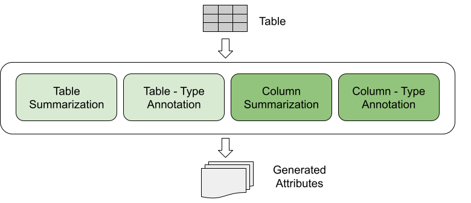
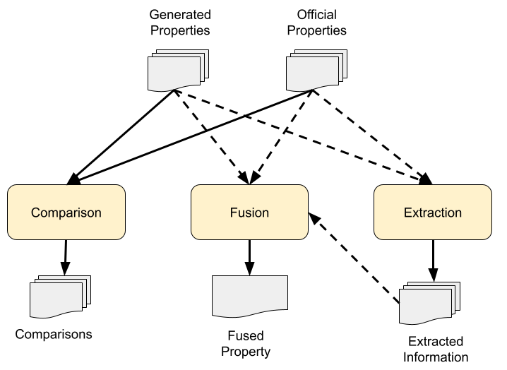

# TableSage
A profiling tool for tabular data leveraging the powerful capabilities of LLMs, appropriate for data scientists.

# Features

  
  

- **Table-related features**: Table-related features of TableSage.
- **Table-related features**: Attribute-related features of TableSage. Dashed lines indicate optional arguments, but at least one should be provided.

| Feature                | Input                                                                 | Output                 |
|------------------------|----------------------------------------------------------------------|------------------------|
| Table Summarization    | Table                                                                | Attribute              |
| Table Type Annotation  | Table                                                                | Attribute              |
| Column Summarization   | Table                                                                | Attribute              |
| Column Type Annotation | Table                                                                | Attribute              |
| Insights Acquisition   | List of Official Attributes (Optional), List of Generated Attributes (Optional) (At least one) | List of Insights       |
| Attributes Comparison  | List of Official Attributes, List of Generated Attributes            | List of Comparisons    |
| Attributes Fusion      | List of Official Attributes (Optional), List of Generated Attributes (Optional), List of Insights (Optional) (At least one) | Attribute              |

# Quickstart
## Installation
pip install tablesage

## Usage
To Be Added

# Acknowledgements
This work was partially funded by the EU Horizon Europe projects STELAR (GA. 101070122)