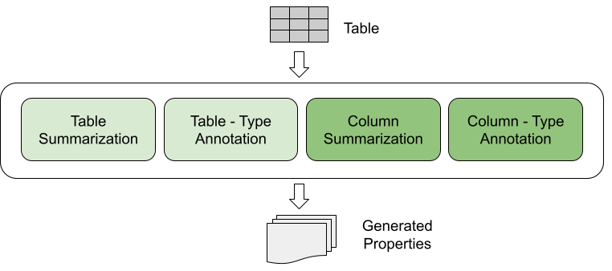

# TableSage
A profiling tool for tabular data leveraging the powerful capabilities of LLMs, appropriate for data scientists.

# Features

<p align="center">
  
  
</p>

- **Table-related features**: Table-related features of TableSage.
- **Table-related features**: Attribute-related features of TableSage. Dashed lines indicate optional arguments, but at least one should be provided.

<table>
  <tr>
    <th>Feature</th>
    <th>Sub-Feature</th>
    <th>Input</th>
    <th>Output</th>
  </tr>
  <tr>
    <td rowspan="2">Table</td>
    <td>Table Summarization</td>
    <td>Table</td>
    <td>Property</td>
  </tr>
  <tr>
    <td>Table Type Annotation</td>
    <td>Table</td>
    <td>Property</td>
  </tr>
  <tr>
    <td rowspan="2">Column</td>
    <td>Column Summarization</td>
    <td>Table</td>
    <td>Property</td>
  </tr>
  <tr>
    <td>Column Type Annotation</td>
    <td>Table</td>
    <td>Property</td>
  </tr>
  <tr>
    <td rowspan="3">Extraction</td>
    <td>Insights Extraction</td>
    <td>List of Official Properties (Optional) <br/> List of Generated Properties (Optional) <br/> (At least one)</td>
    <td>List of Insights</td>
  </tr>
  <tr>
    <td>Spatial Information Extraction</td>
    <td>Table Description</td>
    <td>Property</td>
  </tr>
  <tr>
    <td>Temporal Information Extraction</td>
    <td>Table Description</td>
    <td>Property</td>
  </tr>
  <tr>
    <td>Comparison</td>
    <td>Properties Comparison</td>
    <td>List of Official Properties <br/> List of Generated Properties</td>
    <td>List of Comparisons</td>
  </tr>
  <tr>
    <td rowspan="2">Fusion</td>
    <td>Alternative Properties Fusion</td>
    <td>List of Official Properties (Optional) <br/> List of Generated Properties (Optional) <br/> List of Insights (Optional) <br/> (At least one)</td>
    <td>Property</td>
  </tr>
  <tr>
    <td>Complementary Properties Merging</td>
    <td>List of Official Properties (Optional) <br/> List of Generated Properties (Optional) <br/> (At least one)</td>
    <td>Property</td>
  </tr>
</table>


# Quickstart
## Installation
pip install tablesage

## Usage
You can easily use TableSage by:
```
from tablesage import TableSage

p = TableSage()
p.load_dataset(path=<path>, separator=<separator>)
profile = p.profile_dataset(<model>, endpoint=<openai-endpoint>, token=<token>)
```

You can find more information about OpenAI endpoints [here](https://github.com/openai/openai-python).

# Acknowledgements
This work was partially funded by the EU Horizon Europe projects STELAR (GA. 101070122)